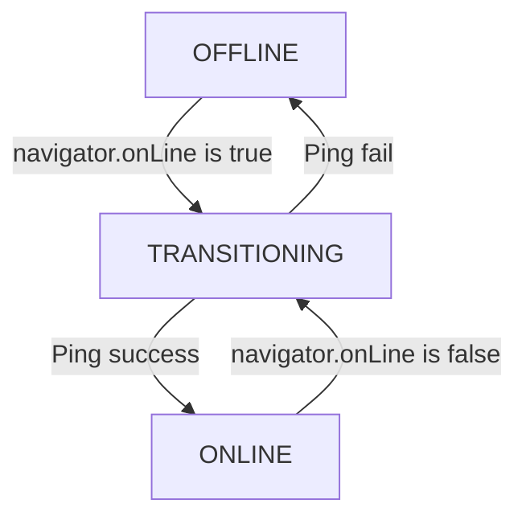

# SYNC-001 — Network Reconnect Detection Architecture

**Author**: webwakaagent1  
**Date**: 2026-02-01  
**Status**: Complete  
**Version**: 1.0.0

---

## 1. Overview

This document details the architecture of the **Network Reconnect Detection (SYNC-001)** module. This component is responsible for reliably detecting when the application's network connectivity is restored after being offline. Accurate and timely detection is critical for triggering the synchronization of offline data.

## 2. Design Principles

The design of the network detection module is guided by the following principles:

- **Reliability**: The module must provide a highly reliable indication of the network status, avoiding both false positives and false negatives.
- **Efficiency**: The detection mechanism should be lightweight and consume minimal system resources.
- **Responsiveness**: The module should detect network changes in a timely manner to ensure that data synchronization can begin as soon as possible.
- **Resilience**: The module must be resilient to transient network fluctuations and other edge cases.

## 3. Architecture

The network detection architecture is based on a hybrid approach that combines passive and active detection methods.

### 3.1. Hybrid Detection

The module uses a combination of:

- **`navigator.onLine`**: A browser API that provides a quick but sometimes unreliable indication of the network status.
- **Active Ping**: A more reliable method that involves sending a `HEAD` request to a known health check endpoint.

### 3.2. State Machine

The module implements a state machine to manage the network status. The possible states are:

- **`ONLINE`**: The application is confirmed to be online.
- **`OFFLINE`**: The application is confirmed to be offline.
- **`TRANSITIONING`**: The network status is in the process of changing.

### 3.3. Debouncing

To prevent rapid state changes due to transient network fluctuations (flapping), the module implements a debouncing mechanism. When a network change is detected, the module enters the `TRANSITIONING` state and waits for a configurable period (default: 2 seconds) before confirming the new state with an active ping.

### 3.4. False Positive Prevention

False positives (incorrectly detecting an online state) are minimized by:

- **Requiring a successful ping**: The module will not transition to the `ONLINE` state without a successful response from the health check endpoint.
- **Verifying the response**: The module checks that the ping response has an `OK` status.

## 4. Integration Patterns

The network detection module is designed to be easily integrated with other components of the offline-first platform. The primary integration point is the **Sync Engine (SYNC-002)**, which subscribes to the `ONLINE` event to trigger the synchronization of the transaction queue.

---

**References**

[1] WebWaka Agent Factory, "SYNC-002 — Automatic Sync Engine", [https://github.com/webwaka-factory/webwaka-agent-factory/issues/44](https://github.com/webwaka-factory/webwaka-agent-factory/issues/44)
