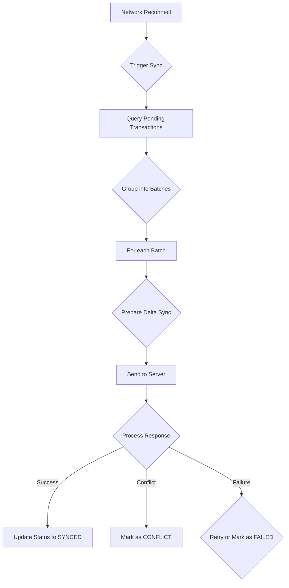

# SYNC-002 — Automatic Sync Engine Architecture

**Author**: webwakaagent1  
**Date**: 2026-02-01  
**Status**: Complete  
**Version**: 1.0.0

---

## 1. Overview

This document outlines the architecture of the **Automatic Sync Engine (SYNC-002)**. This engine is the core component responsible for synchronizing offline transactions with the server. It is designed to be robust, efficient, and resilient to network and server issues.

## 2. Design Principles

- **Automation**: The sync process is triggered automatically upon network reconnection.
- **Efficiency**: The engine uses batching and delta synchronization to minimize payload size and network traffic.
- **Resilience**: The engine includes retry logic and conflict detection to handle transient errors and data inconsistencies.
- **Extensibility**: The architecture is modular, allowing for future enhancements such as different conflict resolution strategies.

## 3. Architecture

The sync engine is composed of several key components:

### 3.1. Sync Coordinator

The sync coordinator is responsible for managing the overall sync process. It is triggered by the **Network Reconnect Detection (SYNC-001)** module and initiates the batching and processing of transactions from the **Persistent Offline Transaction Queue (TXQ-001)**.

### 3.2. Batch Processor

The batch processor groups transactions into batches of a configurable size (default: 50). This reduces the number of requests to the server and improves efficiency.

### 3.3. Delta Sync

To minimize payload size, the engine implements delta synchronization. Instead of sending the entire transaction object, only the essential and changed fields are included in the sync request.

### 3.4. HTTP Sync

The engine uses the `fetch` API to send batches of transactions to the server via a `POST` request to the `/sync/batch` endpoint.

### 3.5. Conflict Detection

The engine detects conflicts by comparing the version or content hash of the local transaction with the server's version. If a conflict is detected, the transaction is marked as failed, and the conflict is logged.

### 3.6. Retry Logic

If a transaction fails to sync due to a transient error, the engine will automatically retry the transaction up to a configurable number of times (default: 3).

## 4. Data Flow

---

**References**

[1] WebWaka Agent Factory, "SYNC-001 — Network Reconnect Detection", [https://github.com/webwakaagent1/webwaka-agent-factory/issues/43](https://github.com/webwakaagent1/webwaka-agent-factory/issues/43)

[2] WebWaka Agent Factory, "TXQ-001 — Persistent Offline Transaction Queue", [https://github.com/webwakaagent1/webwaka-agent-factory/issues/37](https://github.com/webwakaagent1/webwaka-agent-factory/issues/37)
