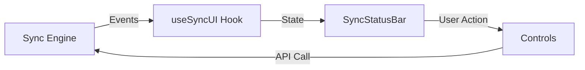

# SYNC-004 — Sync Progress & Error Visibility Architecture

**Author**: webwakaagent1  
**Date**: 2026-02-01  
**Status**: Complete  
**Version**: 1.0.0

## Overview

This document outlines the architecture of the Sync UI components for displaying sync progress, errors, and providing user controls.

## Design Principles

- **Always Visible**: Status indicator always present in UI
- **Real-time Updates**: Immediate reflection of sync state changes
- **User Control**: Pause, resume, retry, cancel operations
- **Error Transparency**: Clear display of failures with actionable remediation
- **Progressive Disclosure**: Expandable details for power users

## Architecture

### Component Hierarchy

```
SyncStatusBar (Main)
├── SyncProgressIndicator (Progress display)
├── SyncErrorDisplay (Error list)
├── SyncControls (Action buttons)
└── SyncNotifications (Toast notifications)
```

### State Management

The `useSyncUI` hook manages all UI state by subscribing to sync engine events:

- SYNC_STARTED → Update status to "syncing"
- SYNC_PROGRESS → Update progress bar
- SYNC_COMPLETED → Show completion notification
- SYNC_FAILED → Display error
- BATCH_FAILED → Add failed transactions to list

### Event Flow



## Integration

- **SYNC-002**: Event source and control API
- **React**: UI framework
- **CSS**: Styling system

---

**References**

[1] WebWaka Agent Factory, "SYNC-002 — Automatic Sync Engine", [https://github.com/webwakaagent1/webwaka-agent-factory/issues/44](https://github.com/webwakaagent1/webwaka-agent-factory/issues/44)
