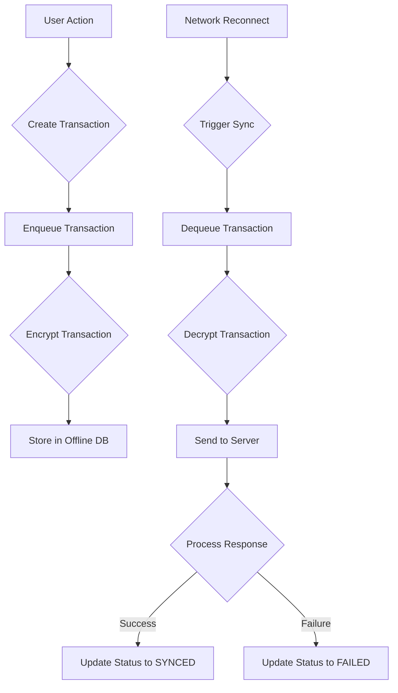

# TXQ-001 — Persistent Offline Transaction Queue Architecture

**Author**: webwakaagent1  
**Date**: 2026-02-01  
**Status**: Complete  
**Version**: 1.0.0

---

## 1. Overview

This document outlines the architecture of the **Persistent Offline Transaction Queue (TXQ-001)**, a critical component of the WebWaka offline-first platform. The transaction queue is responsible for capturing, storing, and managing user actions that occur while the application is offline. It ensures that no data is lost and that all actions are eventually synchronized with the server upon reconnection.

## 2. Design Principles

The transaction queue is built on the following core principles:

- **Durability**: Transactions must survive application restarts and device reboots. Persistence is achieved by leveraging the **Local Offline Data Store Abstraction (OFF-001)**.
- **Reliability**: The queue guarantees that transactions are processed in a predictable and reliable manner. It uses a **First-In, First-Out (FIFO)** ordering to maintain consistency.
- **Performance**: The queue is designed to be lightweight and efficient, with minimal impact on application performance. It supports batch operations and optimized queries.
- **Security**: All transactions are encrypted at rest using the **Offline Data Encryption Layer (OFF-002)**, ensuring that sensitive data is protected.
- **Scalability**: The queue is designed to handle a large volume of transactions, with configurable limits and efficient storage management.

## 3. Queue Architecture

The transaction queue consists of the following key components:

### 3.1. Transaction Interface

The `Transaction` interface defines the structure of a transaction, including its payload, metadata, and status. Key fields include:

- `id`: A unique identifier for the transaction.
- `payload`: The data associated with the transaction (e.g., a form submission).
- `metadata`: Additional information about the transaction, such as its type, timestamp, and priority.
- `status`: The current status of the transaction (e.g., `PENDING`, `SYNCING`, `SYNCED`, `FAILED`).

### 3.2. PersistentTransactionQueue

The `PersistentTransactionQueue` is the concrete implementation of the transaction queue. It provides the following core functionalities:

- **Enqueue**: Adds a new transaction to the queue.
- **Dequeue**: Removes the next transaction from the queue for processing.
- **Query**: Allows for querying the queue based on various criteria (e.g., status, type).
- **Update Status**: Updates the status of a transaction as it moves through its lifecycle.

### 3.3. Storage Integration

The transaction queue is tightly integrated with the **Local Offline Data Store Abstraction (OFF-001)**. This allows the queue to be backend-agnostic, supporting both **IndexedDB** on the web and **SQLite** on mobile devices.

### 3.4. Encryption Integration

All transactions are automatically encrypted before being stored, thanks to the integration with the **Offline Data Encryption Layer (OFF-002)**. This ensures that all data is secure at rest.

## 4. Transaction Lifecycle

A transaction moves through the following states:

1.  **NEW**: The initial state of a transaction when it is first created.
2.  **PENDING**: The transaction is waiting to be synchronized with the server.
3.  **SYNCING**: The transaction is currently being synchronized.
4.  **SYNCED**: The transaction has been successfully synchronized.
5.  **FAILED**: The transaction failed to synchronize after multiple attempts.

## 5. Data Flow Diagram

## 6. Performance Characteristics

The transaction queue is designed for high performance, with the following characteristics:

- **Low Latency**: Enqueue and dequeue operations are optimized for speed.
- **Batch Operations**: The queue supports batching of transactions to reduce overhead.
- **Efficient Queries**: The underlying storage engine provides efficient querying capabilities.

## 7. Scaling Considerations

The transaction queue is designed to scale with the needs of the application. Key scaling features include:

- **Configurable Limits**: The maximum number of transactions in the queue can be configured.
- **Data Retention Policies**: The queue can be configured to automatically prune old or completed transactions.
- **Horizontal Scaling**: The queue can be scaled horizontally by using a distributed storage backend (though this is not part of the initial implementation).

---

**References**

[1] WebWaka Agent Factory, "OFF-001 — Local Offline Data Store Abstraction", [https://github.com/webwakaagent1/webwaka-agent-factory/issues/34](https://github.com/webwakaagent1/webwaka-agent-factory/issues/34)

[2] WebWaka Agent Factory, "OFF-002 — Offline Data Encryption Layer", [https://github.com/webwakaagent1/webwaka-agent-factory/issues/35](https://github.com/webwakaagent1/webwaka-agent-factory/issues/35)
